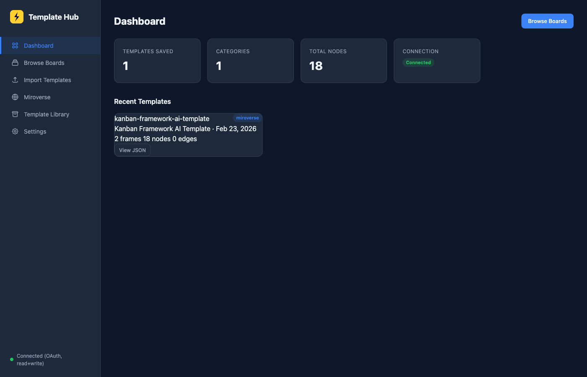
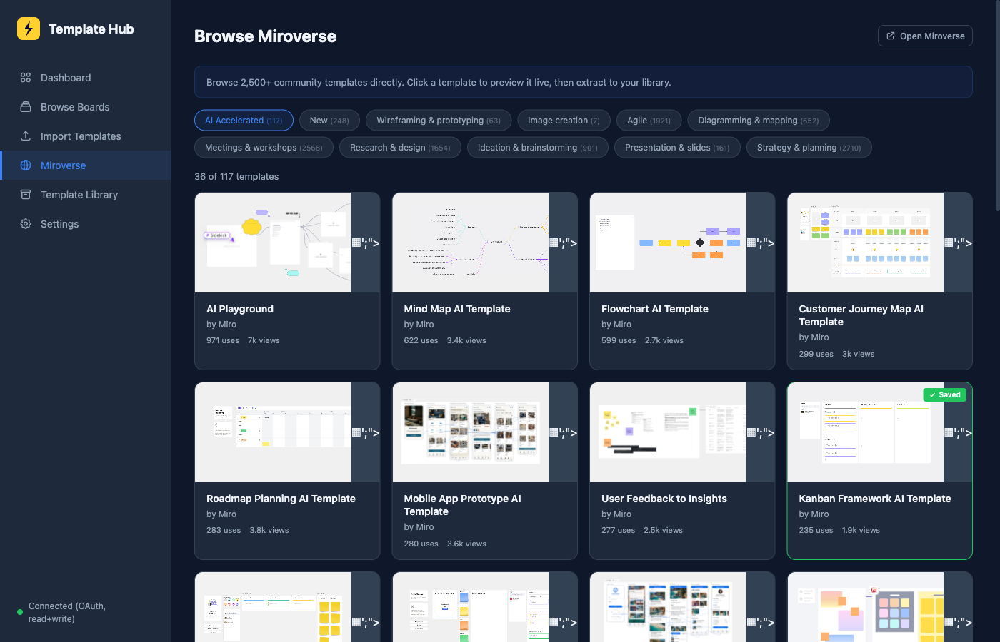
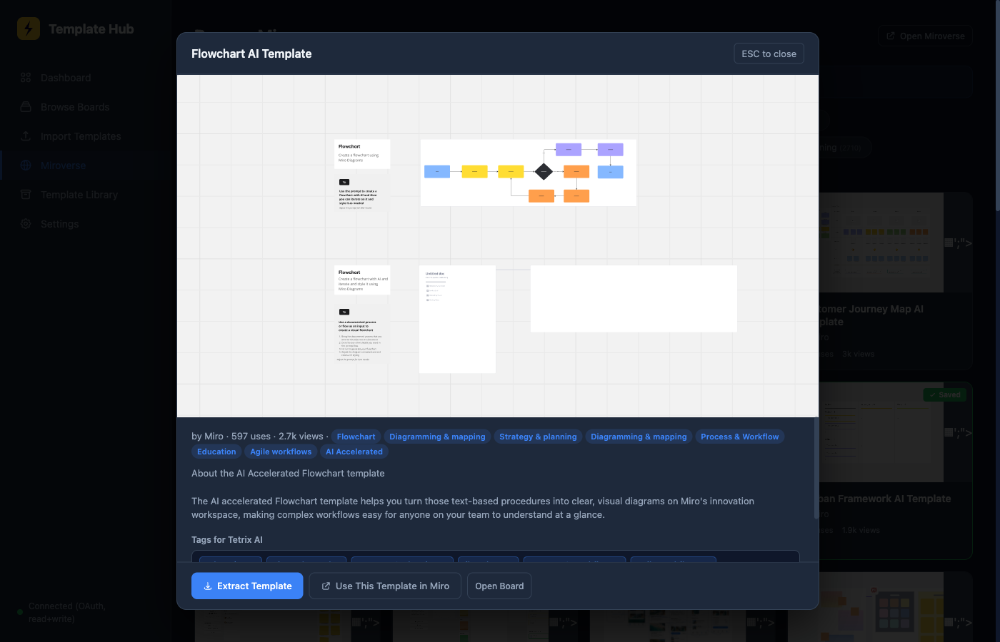
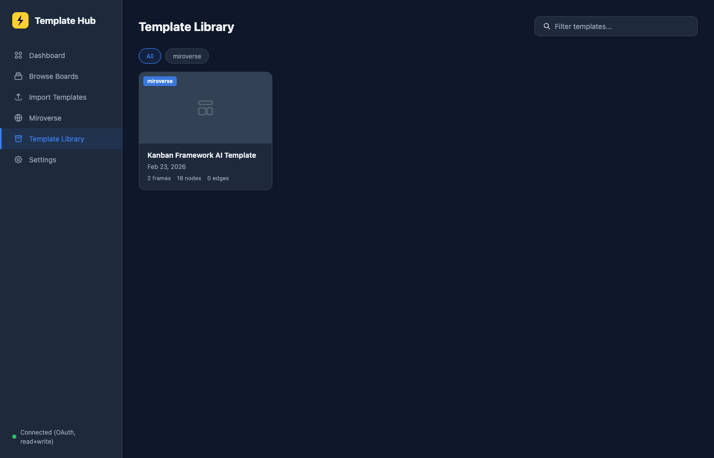
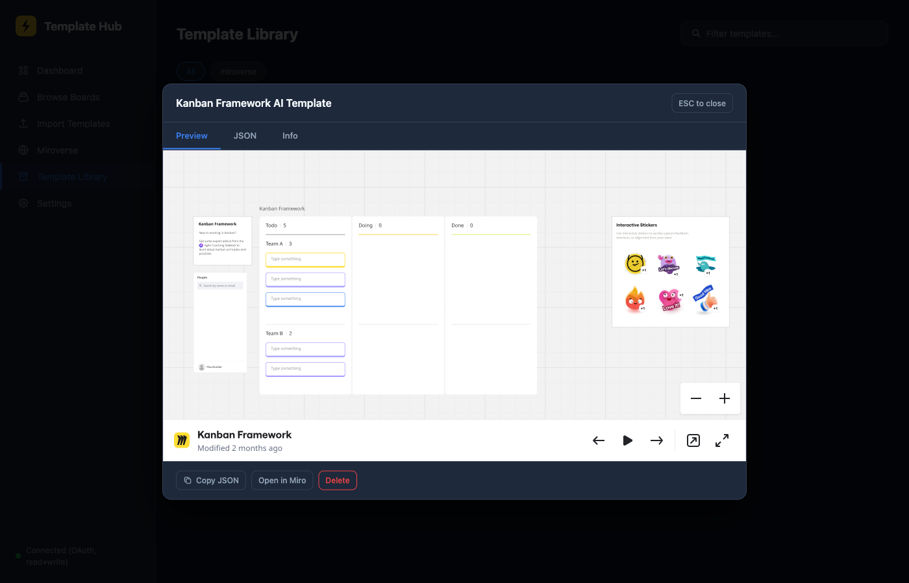
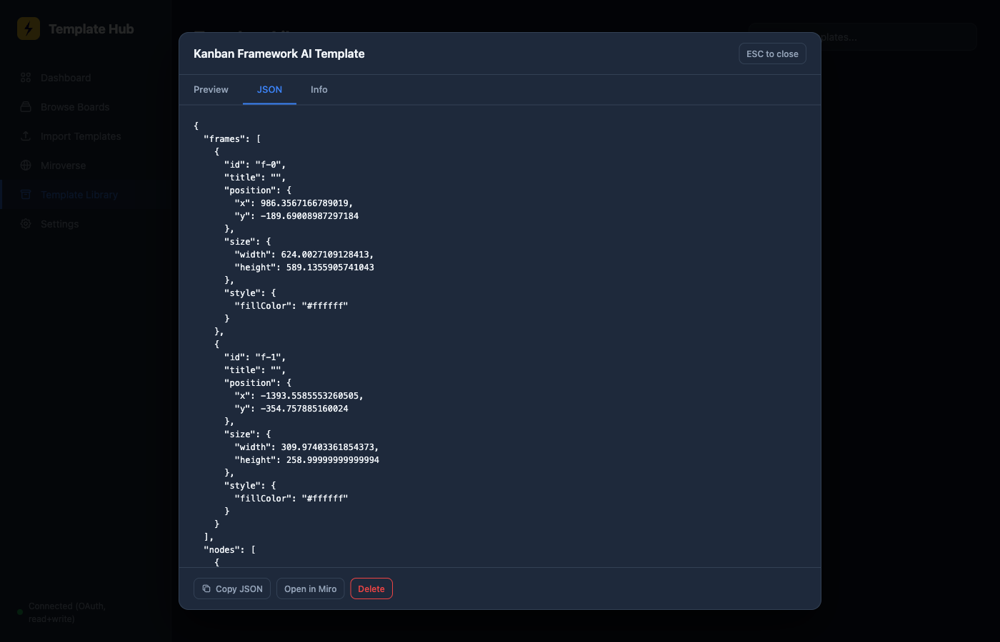
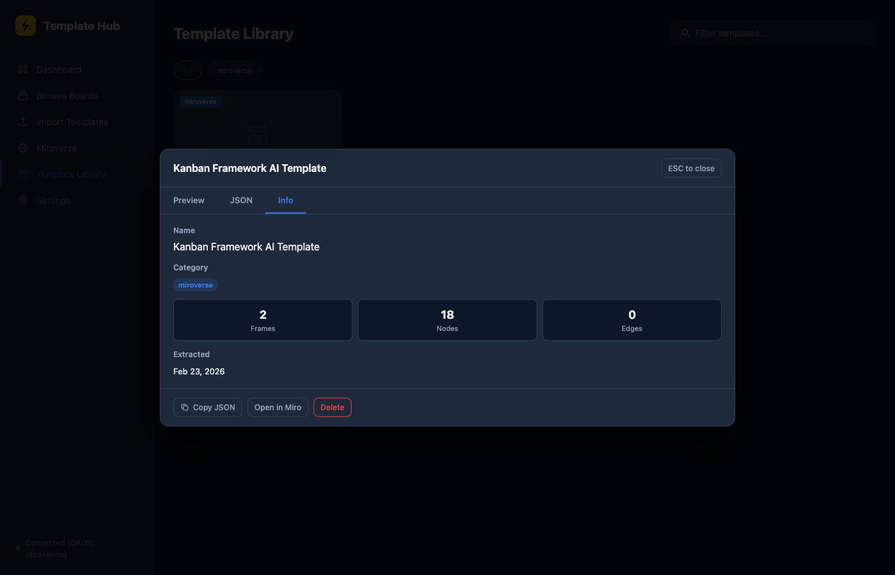

# Miro Template Hub

Curated library of Miro board templates extracted as **BoardView JSON** — browse, preview, and reuse professional templates programmatically via [Tetrix AI](https://github.com/deskree-inc/tetrix-ce).



## What is this?

Miro Template Hub is a standalone web tool that lets you:

1. **Browse Miroverse** — Access 2,500+ community templates directly from the app with live previews
2. **Extract templates** — Convert any Miro board into structured BoardView JSON (frames, nodes, edges, connectors)
3. **Tag & organize** — Add AI-friendly tags so Tetrix knows what each template is about
4. **Preview & manage** — Live board previews, JSON viewer, and full template metadata

The extracted JSON templates in this repository are consumed by **Tetrix AI agents** to create professional Miro boards. Instead of the AI generating coordinates, colors, and layouts from scratch, it uses these curated templates as a foundation — producing boards that look like they were made by a human designer.

## Screenshots

### Browse Miroverse
Browse 2,500+ community templates with categories, preview images, usage stats, and a "Saved" badge for templates already in your library.



### Template Preview Modal
Click any template to open a live preview modal with the actual Miro board embedded, rich description, category tags, and auto-populated AI tags.



### Template Library
Your saved templates displayed as rich cards with preview images, tags, and metadata.



### Template Detail — Live Preview
Open any saved template to see a live interactive preview of the Miro board.



### Template Detail — JSON View
Switch to the JSON tab to inspect the full BoardView structure — frames, nodes, edges, positions, styles, and colors.



### Template Detail — Info
The Info tab shows metadata: name, author, category, description, tags, frame/node/edge counts, and extraction date.



## How It Works

### Architecture

```
Miro Template Hub (Web UI)
        │
        ├── Browse Miroverse ──→ Miro's Next.js Data API (__NEXT_DATA__)
        │                         └── Categories, templates, images, stats
        │
        ├── Live Preview ──────→ Miro Live Embed (iframe)
        │                         └── https://miro.com/app/live-embed/{boardId}/
        │
        ├── Extract Template ──→ Miro REST API v2
        │                         └── GET /v2/boards/{id}/items + /connectors
        │
        └── Save to Library ───→ BoardView JSON + index.json
                                   └── This repository (templates/)
```

### BoardView JSON Schema

Each extracted template is a JSON file with this structure:

```json
{
  "frames": [
    {
      "id": "f-0",
      "title": "Kanban Board",
      "position": { "x": 0, "y": 0 },
      "size": { "width": 1200, "height": 800 },
      "style": { "fillColor": "#ffffff" }
    }
  ],
  "nodes": [
    {
      "id": "n-0",
      "position": { "x": 100, "y": 50 },
      "size": { "width": 300, "height": 80 },
      "style": {
        "fillColor": "#FFD02F",
        "borderColor": "#333333",
        "textColor": "#1a1a1a",
        "fontSize": 16,
        "fontFamily": "open_sans"
      },
      "frameId": "f-0",
      "visualKind": "sticky_note",
      "title": "Task title here"
    }
  ],
  "edges": [
    {
      "id": "e-0",
      "startNodeId": "n-0",
      "endNodeId": "n-1",
      "style": { "strokeColor": "#333333", "strokeWidth": "1.5" }
    }
  ],
  "_metadata": {
    "extracted_at": "2026-02-23T11:02:52",
    "total_items": 20,
    "frames": 2,
    "nodes": 18,
    "edges": 0
  },
  "_template": {
    "name": "kanban-framework-ai-template",
    "category": "miroverse",
    "source": "miroverse",
    "source_slug": "kanban-framework-template-ai",
    "tags": ["kanban", "agile", "ai accelerated"],
    "extracted_at": "2026-02-23T11:02:52"
  }
}
```

### Visual Kinds

Templates can contain these element types:

| `visualKind` | Miro Element | Description |
|---|---|---|
| `sticky_note` | Sticky Note | Color-coded notes with text |
| `shape` | Shape | Rectangles, circles, diamonds, etc. |
| `text` | Text | Rich text with fonts and formatting |
| `card` | Card | Structured cards with title and body |
| `image` | Image | Referenced by URL |
| `frame` | Frame | Container/grouping element |

### Tag System

Each template includes AI-friendly tags in `_template.tags`. Tags are:
- **Auto-generated** from Miroverse categories (e.g., "agile", "diagramming & mapping")
- **User-added** via the Tag Editor in the preview modal
- **Searchable** in the Template Library (filter by tag name)

Tetrix AI uses these tags to match user intent to the right template. For example:
- User says _"create a kanban board"_ → AI matches templates tagged `kanban`
- User says _"make a system architecture diagram"_ → AI matches `architecture`, `diagramming`

## Repository Structure

```
miro-template-hub/
├── README.md
├── LICENSE
├── .gitignore
├── screenshots/              # App screenshots for documentation
│   ├── 01-dashboard.png
│   ├── 02-miroverse-browse.png
│   ├── 03-miroverse-preview.png
│   ├── 04-template-library.png
│   ├── 05-template-detail-preview.png
│   ├── 06-template-detail-json.png
│   └── 07-template-detail-info.png
└── templates/                # Extracted BoardView JSON templates
    ├── index.json            # Master index with metadata for all templates
    └── miroverse/            # Templates extracted from Miroverse
        └── kanban-framework-ai-template.json
```

### index.json

The master index tracks all templates with rich metadata:

```json
{
  "templates": [
    {
      "name": "kanban-framework-ai-template",
      "category": "miroverse",
      "board_id": "uXjVJ7gbAlI=",
      "board_name": "Kanban Framework AI Template",
      "file": "miroverse/kanban-framework-ai-template.json",
      "extracted_at": "2026-02-23T11:02:52",
      "frames": 2,
      "nodes": 18,
      "edges": 0,
      "tags": ["kanban", "agile", "ai accelerated"],
      "image_url": "https://...",
      "description": "A kanban board template with...",
      "author": "Miro",
      "embed_url": "https://miro.com/app/live-embed/..."
    }
  ],
  "categories": ["miroverse"]
}
```

## Running the Template Hub

The Template Hub web UI is part of the [Tetrix CE](https://github.com/deskree-inc/tetrix-ce) project.

### Prerequisites

- Python 3.10+
- A Miro account with API access (OAuth or personal token)

### Quick Start

```bash
# Clone the Tetrix CE repo (contains the Template Hub)
git clone https://github.com/deskree-inc/tetrix-ce.git
cd tetrix-ce/ai/multi-agent/integrations/miro

# Option 1: Set a manual token
export MIRO_TOKEN="your_access_token"

# Option 2: Use OAuth (recommended) — configure in the Settings page
# The app will guide you through OAuth setup at http://localhost:8420/

# Start the Template Hub
python template_hub.py

# Open in browser
open http://localhost:8420
```

### Features

| Feature | Description |
|---|---|
| **Dashboard** | Overview of saved templates, categories, and connection status |
| **Browse Boards** | List all boards in your Miro workspace with search and space filtering |
| **Import Templates** | Step-by-step workflow to import templates from Miroverse to your workspace |
| **Miroverse** | Browse 2,500+ community templates with live previews and one-click extraction |
| **Template Library** | Manage extracted templates with preview, JSON viewer, and metadata |
| **Settings** | OAuth configuration, space management, and token setup |

### Key Capabilities

- **OAuth 2.0** — Secure authentication with automatic token refresh
- **Space Filtering** — Organize boards by Miro spaces (projects)
- **Live Embed Preview** — See the actual board rendered inside the app
- **Rich Text Parsing** — Contentful-style description parsing for clean text output
- **Error Dialog** — Next.js-style error overlay with copy-to-clipboard for easy debugging
- **Batch Extraction** — Extract multiple boards at once
- **Saved Indicator** — Green "Saved" badge on Miroverse templates you've already extracted

## How Tetrix AI Uses These Templates

1. **User request** — _"Create a kanban board for our sprint planning"_
2. **Tag matching** — Tetrix searches `index.json` for templates tagged `kanban`, `sprint`, `agile`
3. **Template loading** — The matching BoardView JSON is loaded as a layout reference
4. **Data injection** — User-specific data (task names, team members, dates) is merged into the template structure
5. **Board creation** — Tetrix calls the Miro API to render the board with professional layout, colors, and typography

The result: boards that look like they were designed by a professional, not auto-generated by an AI guessing coordinates.

## Contributing

We welcome contributions! You can help by:

1. **Extracting more templates** — Run the Template Hub, browse Miroverse, and extract useful templates
2. **Improving tags** — Add better tags that describe what a template is for
3. **Adding categories** — Organize templates into meaningful categories

### Adding a Template

1. Run the Template Hub (`python template_hub.py`)
2. Go to **Miroverse** → browse and find a template
3. Click the template → review in the preview modal
4. Add relevant tags in the Tag Editor
5. Click **Extract Template**
6. The JSON will be saved to `templates/miroverse/`
7. Commit and push to this repo

## License

This project is licensed under the MIT License — see the [LICENSE](LICENSE) file for details.

---

Built with Tetrix AI by [Deskree](https://deskree.com)
